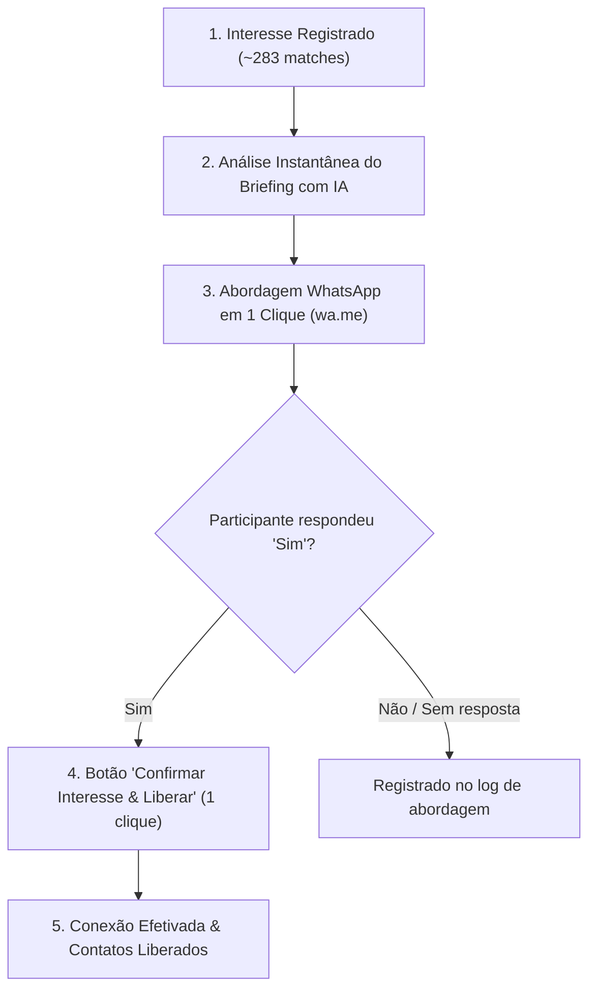

# Guia Operacional Canônico & Fluxo Administrativo — SudoExpo Match (`ADMIN_FLOW.md`)

Este documento é a fonte oficial da arquitetura operacional e dos processos de gestão, auditoria de matches e fechamento de conexões no **SudoExpo Match**, unificando **Equipe e Administrador** em um único fluxo contínuo e de alta produtividade.

---

## 1. Princípio Fundamental: Unificação Total (`Equipe = Administrador`)

Historicamente, a plataforma separava a gestão operacional em dois silos:
1. A **Fila de Atendimento** (`/equipe`), voltada para status de conexão e atendimento presencial.
2. A **Auditoria de Matches** (`/admin/matches`), voltada para análise de scores, motivos e leitura com IA.

**Na versão unificada:**
- Não há mais segregação artificial: tanto membros com papel `staff` quanto `admin` têm acesso à auditoria de matches, geração de briefing comercial por IA, visualização de contatos autorizados para abordagem e disparo de mensagens.
- A barra de navegação superior permite transição fluida e imediata entre:
  - **Auditoria & WhatsApp** (`/admin/matches`)
  - **Fila Operacional** (`/equipe`)
  - **Participantes** (`/admin/participantes`)
  - **Taxonomia & Governança** (`/admin/taxonomia`)
  - **Equipe & Configurações** (`/admin`)

---

## 2. O Funil Operacional em Mínimos Cliques

O objetivo central é transformar o processo manual lento em um pipeline ágil:

### Etapa 1: Localização Imediata dos Matches com Interesse
- Em `/admin/matches`, o operador clica no filtro rápido **"Com interesse registrado"**.
- O sistema filtra imediatamente a lista para os matches onde pelo menos um dos lados marcou a intenção de se conectar (`matches.decision_a = 'interesse'` ou `matches.decision_b = 'interesse'`).

### Etapa 2: Auditoria e Leitura Comercial
- O card exibe o resumo automático do matcher e da IA.
- Clicando no card, o operador abre o `MatchDetailSheet` completo com histórico de sinais, assimetria, motivos e a leitura comercial detalhada da IA.

### Etapa 3: Abordagem Inteligente via WhatsApp
- Diretamente no card (`MatchCardRow`) ou no detalhe (`MatchDetailSheet`), o operador clica no botão **"WhatsApp [Nome]"**.
- Abre-se o **`WhatsAppOutreachModal`**, que detecta automaticamente se aquele participante já foi contatado antes ou se é a primeira vez.

---

## 3. Motor de Mensagens de WhatsApp (1º Contato vs. Contato Recorrente)

O motor (`src/features/admin/outreachMessages.ts`) gera mensagens personalizadas baseadas no contexto de negócios dos dois participantes.

### 3.1. Template de Primeiro Contato (`outreach_count == 0`)
Usado quando a ACIRV aborda o participante pela primeira vez no evento:

> *"Oi, [Nome]! Como vai você? Aqui é o Kevyn, da comunicação da ACIRV. Graças ao seu cadastro no SudoExpo Match, encontrei uma ótima oportunidade de negócio para você. [Pessoa A], da [Empresa], demonstrou interesse em se conectar com você e pode entrar em contato. O que você pode ganhar com essa conexão: [benefício]. Por que essa conexão faz sentido: [justificativa]. Essa conexão faz sentido para você?"*

### 3.2. Template de Contato Recorrente (`outreach_count > 0`)
Quando o participante já recebeu uma oportunidade anterior, o tom se torna ágil, eliminando apresentações repetidas:

> *"Oi, [Nome]! Sou eu aqui de novo, Kevyn, da comunicação da ACIRV. Encontrei mais uma oportunidade de conexão para você. [Pessoa C], da [Empresa], pode entrar em contato contigo. O que você pode ganhar com essa conexão: [benefício]. Por que essa conexão faz sentido: [justificativa]."*

### 3.3. Composição Dinâmica dos Parâmetros
- **`[Nome]`**: Primeiro nome do participante destinatário (`getFirstName`), gerando proximidade.
- **`[Pessoa A]` / `[Empresa]`**: Nome e empresa do parceiro do match.
- **`[benefício]`**: Extraído prioritariamente da leitura comercial da IA (`briefing.sides[target]`) ou da razão determinística de maior peso (`reasons[target]`).
- **`[justificativa]`**: Resumo executivo da IA (`briefing.summary`) ou complementaridade de ofertas e necessidades.

### 3.4. Ações Disponíveis na Modal
- **"Abrir no WhatsApp"**: Gera o link `https://wa.me/5564...` e abre em nova aba, registrando automaticamente a abordagem no banco (`record_outreach_attempt`).
- **"Copiar Mensagem"**: Copia o texto para a área de transferência e registra o log de abordagem.
- **"Restaurar / Regenerar"**: Restaura o texto original da IA caso o operador tenha editado.

---

## 4. Fechamento e Liberação em 1 Clique

Quando o participante responde positivamente no WhatsApp, o operador não precisa refazer cadastros nem abrir telas adicionais:
1. Dentro da própria modal (`WhatsAppOutreachModal`) ou no detalhe do match, clica no botão:
   **"Confirmar Interesse & Liberar"**
2. A RPC `public.admin_quick_confirm_connection` executa atomicamente no PostgreSQL:
   - Registra a decisão `'interesse'` para ambas as partes em `public.match_decisions`.
   - Cria ou localiza a linha correspondente em `public.connections`.
   - Avança o status da conexão diretamente para `'apresentados'`.
   - Registra `contact_released_at = now()` e `contact_released_by = auth.uid()`.
   - Grava evento de auditoria em `public.connection_events` e `public.audit_logs`.
   - Libera os contatos no dashboard de ambos os participantes.

---

## 5. Arquitetura de Dados & Segurança

### 5.1. Tabela `public.outreach_logs`
Rastreia cada abordagem realizada para cada participante dentro do escopo estrito do evento:

| Coluna | Tipo | Descrição |
| :--- | :--- | :--- |
| `id` | `uuid` | Chave primária |
| `event_id` | `text` | Evento (`sudoexpo-2026`, etc.) |
| `match_id` | `uuid` | Match originador da oportunidade |
| `profile_id` | `uuid` | Participante destinatário da mensagem |
| `target_phone` | `text` | Telefone sanitizado de destino |
| `sender_user_id` | `uuid` | Operador / Administrador que disparou |
| `template_type` | `text` | `'first_contact'` ou `'recurrent_contact'` |
| `message_preview`| `text` | Prévia do texto disparado (auditoria) |
| `created_at` | `timestamptz`| Carimbo de data/hora do disparo |

### 5.2. RPCs Canônicas do Fluxo
- **`public.admin_get_match_contacts(_match_id uuid)`**:
  Retorna nomes, empresas, telefones e e-mails de ambos os lados, acompanhados da contagem de abordagens prévias (`outreach_count`) e data do último contato (`last_outreach_at`).
- **`public.record_outreach_attempt(...)`**:
  Insere registro em `outreach_logs` e devolve a contagem incrementada.
- **`public.admin_quick_confirm_connection(_match_id uuid, _reason text)`**:
  Efetivação de conexão e liberação de contatos em 1 clique.
- **`public.admin_list_matches` e `public.admin_get_match_detail`**:
  Configurados com `public.has_any_event_role`, permitindo acesso total tanto a administradores quanto a atendentes da equipe (`Equipe = Administrador`).

---

## 6. Boas Práticas Operacionais
1. **Priorizar Sempre Matches com Interesse**: Atenda primeiro as pessoas que já clicaram em "Tenho interesse" no seu aplicativo de participante. Elas têm a maior taxa de conversão em negócios na feira.
2. **Revisão Humana do Briefing**: Antes de disparar para contatos estratégicos (ex.: grandes indústrias), confira rapidamente a leitura comercial gerada pela IA.
3. **Respeito aos Dados Pessoais**: Contatos telefônicos são sensíveis. O sistema audita cada consulta e disparo em `public.audit_logs` para conformidade com a LGPD e a política de privacidade da ACIRV.
