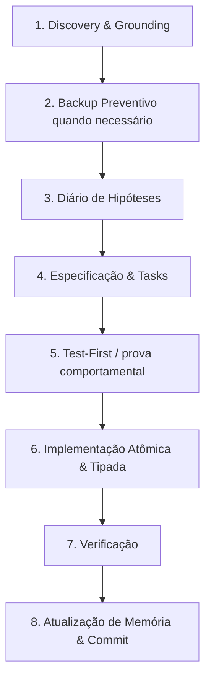

<!-- LOVABLE:BEGIN -->
> [!IMPORTANT]
> This project is connected to [Lovable](https://lovable.dev). Avoid rewriting
> published git history — force pushing, or rebasing/amending/squashing commits
> that are already pushed — as it rewrites history on Lovable's side and the
> user will likely lose their project history.
>
> Commits you push to the connected branch sync back to Lovable and show up in
> the editor, so keep the branch in a working state.
<!-- LOVABLE:END -->

# Guia Completo do Agente & Playbook de Desenvolvimento — SudoExpo Match

Este documento é a fonte canônica de instruções operacionais para **qualquer agente de IA ou desenvolvedor** atuando no repositório **SudoExpo Match**. Ele consolida:
1. **O Funcionamento Geral do SudoExpo Match** (arquitetura, regras de negócio, banco de dados, motor de matching e segurança).
2. **O Espelho Sintético do Playbook de Qualidade** (Quality-First Development Playbook de 69 páginas).
3. **Diretrizes Invioláveis de Execução**, garantindo rigor de engenharia, integridade de dados e conformidade contínua mesmo sem acesso aos documentos externos originais.

---

## PARTE 1: Funcionamento Geral do SudoExpo Match

### 1.1. Visão do Produto
O **SudoExpo Match** é uma plataforma de inteligência de negócios e matchmaking B2B desenvolvida para feiras comerciais e rodadas de negócios organizadas pela **ACIRV** (Associação Comercial, Industrial e de Serviços de Rio Verde), tendo como evento principal a **SudoExpo 2026**.

**Proposta de Valor**: Conectar participantes de eventos corporativos com base na compatibilidade real entre o que um empresário **oferece** (produtos, serviços, capacidade técnica) e o que o outro **procura** (necessidades, insumos, fornecedores, investimentos), gerando oportunidades qualificadas de networking e negócios.

### 1.2. Stack Tecnológica
- **Framework Frontend**: TanStack Start com React 19 e Vite 8.
- **Roteamento**: TanStack Router (rotas baseadas em arquivos em `src/routes/`).
- **Gerenciamento de Estado de Servidor**: TanStack React Query v5.
- **Estilização**: Tailwind CSS v4 com Radix UI primitives e Lucide Icons.
- **Validação de Schemas**: Zod v3 para contratos de entrada/saída de RPCs e formulários.
- **Banco de Dados & Auth**: PostgreSQL gerenciado no Supabase/Lovable Cloud com Row Level Security (RLS).
- **Autenticação de Participantes**: fluxo por WhatsApp/telefone E.164, sem senha alfanumérica do participante.
- **Administrador & Suporte**: disponível via WhatsApp `+55 64 99247-0988`.

---

### 1.3. Arquitetura de Dados & Multi-Tenancy por Evento

As entidades transacionais relevantes carregam `event_id` e o matcher é delimitado pelo evento:

```text
[public.events]
   ├── [public.profiles] (event_id)
   │      ├── [public.profile_offers] (profile_id, event_id)
   │      ├── [public.profile_needs] (profile_id, event_id)
   │      └── [private.profile_contacts] (profile_id, ...)
   ├── [public.matches] (event_id, a_profile_id, b_profile_id)
   ├── [public.connections] (event_id, match_id)
   └── [public.event_staff] (event_id, user_id, role)
```

#### Eventos Registrados e Isolamento Estrito
1. `cafe-entre-amigos-ago-2026`: evento histórico do piloto de agosto/2026.
2. `sudoexpo-2026`: evento principal da SudoExpo 2026.

#### Regra Inviolável de Isolamento
- Participantes cadastrados em um evento **NUNCA** recebem match com participantes de outro evento.
- `_recompute_matches_for_profile(p_profile_id, p_event_id)` restringe candidatos a `p.event_id = p_event_id`.

#### Check-in de Veteranos
O fluxo multi-eventos pode localizar um perfil anterior, clonar os dados profissionais permitidos para o evento de destino, obter novo consentimento quando aplicável e recalcular o matcher no evento correto. Nenhum match cross-event é criado sem a entrada formal do participante no evento de destino.

---

### 1.4. Motor de Matching v2.4 & Classificação por Perspectiva

A especificação documental completa e canônica do algoritmo vive em **`docs/specs/matcher-v2.4.md`**. Quando houver divergência entre texto antigo e essa especificação, confira também a implementação executável em `public._recompute_matches_for_profile`.

- **Não há um score simétrico único**: cada dupla possui `score_for_a` e `score_for_b`, e a UI deve derivar o rótulo da perspectiva correta.
- **Pesos atuais por perspectiva**:
  - o outro oferece algo que eu procuro: `+55`;
  - o outro procura algo que eu ofereço: `+25`;
  - necessidade prioritária atendida diretamente: `+10`;
  - relação complementar curada na taxonomia: `+12..+30` (`round(weight × 0,30)`, somente peso `>=40`);
  - perfil desejado completo (“quem eu procuro”): `+20/+30/+40` conforme 1/2/3 critérios informados;
  - perfil desejado mútuo: `+10`;
  - match comercial direto entre segmentos diferentes: `+5`;
  - perfil atualizado recentemente: `+3`;
  - mesma cidade: `+2`.
- **Classificação por perspectiva**:
  - `alta_compatibilidade`: score `>= 75`;
  - `boa_oportunidade`: score `>= 40` e `< 75`;
  - `conexao_possivel`: score `< 40`.
- **Score não é porcentagem** e pode ultrapassar 100 (máximo teórico atual: 180).
- **`matches.label` é legado** e reflete o maior score da dupla; não deve ser usado para a classificação apresentada ao participante. Use sempre o label derivado da perspectiva (`label_me`/`label_a`/`label_b`).
- **Sinais que podem criar a dupla**: overlap comercial direto, relação complementar de taxonomia válida ou perfil desejado completo em alguma direção. Cidade, recência, prioridade e `+5` de segmentos diferentes apenas elevam um par já sinalizado.

#### Taxonomia no matcher
- `taxonomy_match()` é determinístico: mesmo ID canônico, label normalizada, sinônimo explícito ou contenção com fronteira de palavra.
- Não há embedding, LLM pairwise, cosine similarity ou fuzzy score semântico no core do matcher.
- Relações complementares são direcionais: `from_taxonomy_item_id = NECESSIDADE` → `to_taxonomy_item_id = OFERTA`.
- A relação correta é lida como: **“quem PRECISA de A pode combinar com quem OFERECE B”**; o inverso só existe se cadastrado separadamente.
- O bônus `+5` historicamente chamado de “complementaridade” não usa o grafo taxonômico: ele só indica overlap comercial direto entre empresas de segmentos diferentes. Em textos novos, prefira **“conexão entre segmentos”**.

#### Snapshots e governança taxonômica
`matches` são snapshots. Alterações de item, sinônimo ou relação mudam a semântica do algoritmo, mas precisam de recomputação para atualizar pares persistidos. A camada de governança adicionada em setembro/2026 mantém uma revisão da taxonomia, expõe se um evento está `dirty` e permite rebuild admin-only por evento.

- **Privacidade de Contatos**: WhatsApp e telefone privado ficam isolados no schema `private.profile_contacts`. A liberação segue o fluxo de interesse/conexão e é auditada.

---

### 1.5. Painel Administrativo & Governança
- Rotas: `/admin`, `/admin/participantes`, `/admin/matches`, `/admin/taxonomia`.
- **`AdminEventContext` & `EventSelector`**: o contexto selecionado deve ser respeitado por todas as consultas e mutações administrativas.
- **Check-in Manual por Staff/Admin**: permite trazer um participante de evento anterior para o evento atual sem misturar os dados entre eventos.
- **Taxonomia**: `/admin/taxonomia` governa itens, sinônimos, relações complementares, cobertura canônica e rebuild de snapshots do matcher.

---

## PARTE 2: Espelho Canônico do Playbook de Desenvolvimento (Quality-First)

Este resumo sintetiza o Playbook de Desenvolvimento de Alta Qualidade. **Todo agente deve seguir este protocolo com disciplina.**

### 2.1. Filosofia Central: "Zero Adivinhações & Qualidade em Primeiro Lugar"
1. **Nunca suponha o que pode ser verificado**: inspecione schema SQL, migrations, testes e código antes de propor mudanças.
2. **Código pela metade é proibido**: cada tarefa deve ser entregue completa, tipada, testada e integrada quando o ambiente permitir.
3. **Não peça confirmações triviais**: se o objetivo está claro e é seguro, execute o ciclo de ponta a ponta.
4. **Preservação de Histórico Git**: NUNCA execute `git push --force`, rebase, amend ou squash sobre commits já publicados que alimentam o Lovable.

---

### 2.2. Estrutura de Documentação Viva (`docs/`)

| Arquivo | Finalidade Canônica |
| :--- | :--- |
| `docs/CONSTITUTION.md` | Princípios invioláveis de engenharia e segurança. |
| `docs/CURRENT_STATE.md` | Fotografia do estado atual do sistema. |
| `docs/DECISIONS.md` | Registro de decisões de arquitetura. |
| `docs/CONSTRAINTS.md` | Restrições técnicas rígidas. |
| `docs/TESTING.md` | Estratégia de testes e comandos. |
| `docs/KNOWN_ISSUES.md` | Problemas conhecidos e notas operacionais. |
| `docs/roadmap.md` | Visão estratégica, backlog e status de implementação. |
| `docs/specs/` | Especificações e contratos observáveis por feature. |
| `docs/engineering-journal/` | Hipóteses, experimentos e evidências. |

---

### 2.3. Ciclo de Vida de uma Tarefa



#### Etapa 1: Discovery & Grounding
- Inspecione arquivos, schema e histórico Git.
- Jamais inicie modificações profundas sem entender o contexto completo.

#### Etapa 2: Backup Preventivo
- Antes de migração destrutiva/refatoração profunda, use branch/tag de backup sem reescrever histórico publicado.

#### Etapa 3: Formulação de Hipóteses
- Registre hipóteses relevantes em `docs/engineering-journal/CURRENT.md` quando o trabalho exigir investigação.

#### Etapa 4: Especificação e Decomposição
- Crie/atualize uma especificação observável e tarefas granulares para mudanças significativas.

#### Etapa 5: Abordagem Test-First
- Regras críticas de banco e matcher precisam de teste automatizado ou prova SQL reproduzível antes de serem dadas como concluídas.

#### Etapa 6: Implementação Atômica
- Código limpo, menor mudança suficiente, sem `any` desnecessário, com mensagens amigáveis ao usuário em português.

#### Etapa 7: Verificação Rigorosa
- Quando o ambiente tiver dependências: execute `npm run typecheck`, suíte Vitest relevante e provas SQL aplicáveis.
- Se alguma verificação não puder ser executada, documente a limitação; nunca declare teste verde sem tê-lo rodado.

#### Etapa 8: Memória, Commit e Push
- Sincronize documentação relevante e publique commits sem reescrever histórico do Lovable.

---

## PARTE 3: Diretrizes Operacionais para Agentes de IA

1. **Autonomia com Responsabilidade**: conduza o desenvolvimento até o fim possível e diferencie implementação de validação executada.
2. **Preservação de Dados de Produção**: dados de eventos passados não podem ser apagados por conveniência; migrações destrutivas exigem decisão explícita e plano de reversão.
3. **Canal Oficial de Contato**: suporte ao administrador via WhatsApp `+55 64 99247-0988` quando a experiência do produto pedir escalonamento humano.
