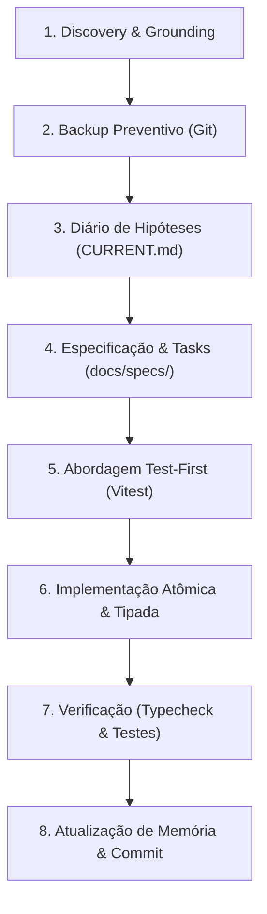

<!-- LOVABLE:BEGIN -->
> [!IMPORTANT]
> This project is connected to [Lovable](https://lovable.dev). Avoid rewriting
> published git history — force pushing, or rebasing/amending/squashing commits
> that are already pushed — as it rewrites history on Lovable's side and the
> user will likely lose their project history.
>
> Commits you push to the connected branch sync back to Lovable and show up in
> the editor, so keep the branch in a working state.
<!-- LOVABLE:END -->

# Guia Completo do Agente & Playbook de Desenvolvimento — SudoExpo Match

Este documento é a fonte canônica de instruções operacionais para **qualquer agente de IA ou desenvolvedor** atuando no repositório **SudoExpo Match**. Ele consolida:
1. **O Funcionamento Geral do SudoExpo Match** (arquitetura, regras de negócio, banco de dados, motor de matching e segurança).
2. **O Espelho Sintético do Playbook de Qualidade** (Quality-First Development Playbook de 69 páginas).
3. **Diretrizes Invioláveis de Execução**, garantindo rigor de engenharia, integridade de dados e conformidade contínua mesmo sem acesso aos documentos externos originais.

---

## PARTE 1: Funcionamento Geral do SudoExpo Match

### 1.1. Visão do Produto
O **SudoExpo Match** é uma plataforma de inteligência de negócios e matchmaking B2B desenvolvida para feiras comerciais e rodadas de negócios organizadas pela **ACIRV** (Associação Comercial, Industrial e de Serviços de Rio Verde), tendo como evento principal a **SudoExpo 2026**.

**Proposta de Valor**: Conectar participantes de eventos corporativos com base na compatibilidade real entre o que um empresário **oferece** (produtos, serviços, capacidade técnica) e o que o outro **procura** (necessidades, insumos, fornecedores, investimentos), gerando oportunidades qualificadas de networking e negócios.

### 1.2. Stack Tecnológica
- **Framework Frontend**: [TanStack Start](https://tanstack.com/start) com React 19 e Vite 8.
- **Roteamento**: TanStack Router (rotas baseadas em arquivos em `src/routes/`).
- **Gerenciamento de Estado de Servidor**: TanStack React Query v5.
- **Estilização**: Tailwind CSS v4 com Radix UI primitives e Lucide Icons.
- **Validação de Schemas**: Zod v3 para contratos de entrada/saída de todas as RPCs e formulários.
- **Banco de Dados & Auth**: PostgreSQL gerenciado no Supabase com Row Level Security (RLS) habilitado em 100% das tabelas.
- **Autenticação de Participantes**: Passwordless via WhatsApp / Telefone E.164 (`+55XXXXXXXXXXX`), sem necessidade de senha alfanumérica.
- **Administrador & Suporte**: Disponível diretamente via WhatsApp: `+55 64 99247-0988` (link direto: `https://wa.me/5564992470988`).

---

### 1.3. Arquitetura de Dados & Multi-Tenancy por Evento

Todas as entidades transacionais e relacionais possuem a chave de partição `event_id text references public.events(id)`:

```
[public.events]
   ├── [public.profiles] (event_id)
   │      ├── [public.profile_offers] (profile_id, event_id)
   │      ├── [public.profile_needs] (profile_id, event_id)
   │      └── [private.profile_contacts] (profile_id, phone_e164, raw_phone)
   ├── [public.matches] (event_id, profile_a_id, profile_b_id)
   ├── [public.connections] (event_id, match_id)
   └── [public.event_staff] (event_id, user_id, role)
```

#### Eventos Registrados e Isolamento Estrito:
1. `'cafe-entre-amigos-ago-2026'` ("Café Entre Amigos - Ago/2026"): Evento histórico que armazena os participantes reais do teste piloto realizado na ACIRV em Agosto/2026.
2. `'sudoexpo-2026'` ("SudoExpo 2026"): Evento principal da feira comercial, ativo no `src/config/event.ts`.

#### Regra Inviolável de Isolamento:
- Participantes cadastrados em um evento **NUNCA** recebem match com participantes de outro evento.
- A função de banco `_recompute_matches_for_profile(p_profile_id, p_event_id)` filtra rigidamente por `WHERE p.event_id = p_event_id`.

#### Fluxo de Check-in em 1 Clique para Veteranos:
- Quando alguém que participou do Café Entre Amigos (ou edições anteriores) digita seu WhatsApp na entrada da SudoExpo, a RPC `lookup_profile_by_phone` identifica o histórico (`has_previous_event = true`).
- A tela exibe um convite acolhedor: *"Você participou do Café Entre Amigos. Deseja participar da SudoExpo 2026?"*.
- Ao clicar em **"Confirmar Check-in na SudoExpo 2026"**, a RPC `participant_checkin_by_phone`:
  1. Clona com segurança os dados do perfil, ofertas e necessidades para o evento `sudoexpo-2026`.
  2. Registra o contato privado.
  3. Recomputa imediatamente os matches para o novo evento.

---

### 1.4. Motor de Matching & Classificação por Perspectiva
- **Não há score único unilateral**: Cada conexão possui duas perspectivas independentes:
  - `score_for_participant` e `label_for_participant`
  - `score_for_other` e `label_for_other`
- **Classificação**:
  - `oportunidade_alta` (score >= 80)
  - `oportunidade_media` (score >= 60)
  - `oportunidade_baixa` (score >= 40)
  - `potencial_parceria` (compatibilidade de nicho/segmento)
- **Privacidade de Contatos**: WhatsApp e telefone privado ficam isolados no schema `private.profile_contacts`. Só são liberados após ambas as partes demonstrarem interesse ou mediação da equipe de staff.

---

### 1.5. Painel Administrativo & Governança
- Rotas: `/admin` (dashboard), `/admin/participantes`, `/admin/matches`, `/admin/taxonomia`.
- **`AdminEventContext` & `EventSelector`**: Dropdown no cabeçalho permite que o staff visualize e filtre métricas, participantes e matches de qualquer edição (SudoExpo 2026 ou Café Entre Amigos).
- **Check-in Manual por Staff**: Na gaveta `ParticipantDetailSheet` e na tabela de participantes, botões dedicados permitem forçar o check-in de qualquer participante antigo na SudoExpo 2026.

---

## PARTE 2: Espelho Canônico do Playbook de Desenvolvimento (Quality-First)

Este resumo sintetiza as 69 páginas do Playbook de Desenvolvimento de Alta Qualidade. **Todo agente deve seguir este protocolo com disciplina absoluta.**

### 2.1. Filosofia Central: "Zero Adivinhações & Qualidade em Primeiro Lugar"
1. **Nunca suponha o que pode ser verificado**: Inspecione o schema SQL real, as migrations e o código antes de propor qualquer mudança.
2. **Código pela metade é proibido**: Cada tarefa deve ser entregue completa, tipada, testada e integrada. Não deixe `TODOs` soltos ou implementações incompletas para o usuário terminar.
3. **Não peça confirmações triviais**: Se o objetivo está claro, execute o ciclo de ponta a ponta sem paralisar o trabalho com perguntas desnecessárias.
4. **Preservação de Histórico Git**: NUNCA execute `git push --force`, rebase ou alteração de commits já enviados para a `origin/main`, pois o repositório é sincronizado com o Lovable.

---

### 2.2. A Estrutura de Documentação Viva (`docs/`)
Todo o conhecimento arquitetural do projeto deve permanecer sincronizado nos arquivos canônicos da pasta `docs/`:

| Arquivo | Finalidade Canônica |
| :--- | :--- |
| `docs/CONSTITUTION.md` | Princípios invioláveis da engenharia, arquitetura imutável e contratos de segurança. |
| `docs/CURRENT_STATE.md` | Fotografia precisa do estado atual do sistema, migrations ativas, testes e branch. |
| `docs/DECISIONS.md` | Registro de Decisões de Arquitetura (ADRs) com contexto, decisão e consequências. |
| `docs/CONSTRAINTS.md` | Restrições técnicas rígidas (RLS, privacidade de contatos, rate limits, Lovable). |
| `docs/TESTING.md` | Estratégia de testes, suítes existentes, comandos e limitações de ambiente. |
| `docs/KNOWN_ISSUES.md` | Problemas conhecidos, workarounds e notas operacionais de ambiente. |
| `docs/roadmap.md` | Visão estratégica das entregas, status de implementação e novos épicos. |
| `docs/specs/<feature>/` | Tríade de entrega: `spec.md` (requisitos), `plan.md` (design) e `tasks.md` (checklist). |
| `docs/engineering-journal/` | Registro de hipóteses (`CURRENT.md`), experimentos e evidências empíricas. |

---

### 2.3. O Ciclo de Vida de uma Tarefa (8 Etapas Obrigatórias)



#### Etapa 1: Discovery & Grounding
- Inspecione arquivos com `view_file` e `grep_search`.
- Verifique o branch atual (`git status`, `git log`).
- Jamais inicie modificações sem entender o contexto completo.

#### Etapa 2: Backup Preventivo
- Antes de qualquer migração de banco de dados ou refatoração profunda, crie um branch de backup e uma tag no GitHub:
  ```bash
  git branch backup-YYYYMMDD
  git tag backup-YYYYMMDD
  git push origin backup-YYYYMMDD --tags
  ```

#### Etapa 3: Formulação de Hipóteses
- No arquivo `docs/engineering-journal/CURRENT.md`, registre hipóteses no formato `H-XXX` (Claim, Rationale, Prova Esperada).

#### Etapa 4: Especificação e Decomposição de Tarefas
- Crie ou atualize em `docs/specs/<nome-da-feature>/`:
  - `spec.md`: O que o sistema deve fazer (critérios de aceite observáveis).
  - `plan.md`: Arquitetura técnica e arquivos impactados.
  - `tasks.md`: Lista com checkboxes `[ ]` das tarefas granulares.

#### Etapa 5: Abordagem Test-First
- Antes de dar uma tarefa por concluída, crie testes de unidade ou contrato em `src/__tests__/`.

#### Etapa 6: Implementação Atômica
- Escreva código limpo, sem `any` desnecessário, com tratamento explícito de erros e mensagens amigáveis ao usuário em português.
- Use `replace_file_content` para edições cirúrgicas e `write_to_file` para novos arquivos.

#### Etapa 7: Verificação Rigorosa
- Execute sempre:
  ```bash
  npm run typecheck    # Deve sair com código 0 (sem erros de TypeScript)
  npx vitest run <suíte> # Todos os testes devem passar
  ```

#### Etapa 8: Atualização de Memória, Commit e Push
- Atualize `docs/CURRENT_STATE.md`, `docs/roadmap.md`, `docs/engineering-journal/CURRENT.md` e marque as tarefas em `tasks.md` como `[x]`.
- Faça o commit com mensagem semântica: `feat: ...`, `fix: ...`, `docs: ...`.
- Envie para o GitHub: `git push origin main`.

---

## PARTE 3: Diretrizes Operacionais para Agentes de IA

1. **Autonomia com Responsabilidade**:
   - Conduza o desenvolvimento até o fim. Verifique se o código realmente compila e se os testes passam antes de devolver a palavra ao usuário.
2. **Preservação de Dados de Produção**:
   - Dados de eventos passados são sagrados. Nenhuma migração SQL pode rodar `DROP TABLE`, `TRUNCATE` ou deletar perfis existentes sem migração explícita.
3. **Canal Oficial de Contato**:
   - Suporte ao Administrador: WhatsApp `+55 64 99247-0988` (URL: `https://wa.me/5564992470988`).
   - Se o usuário final relatar dúvidas ou dificuldades no evento, a interface deve sempre direcioná-lo com clareza para este contato.

